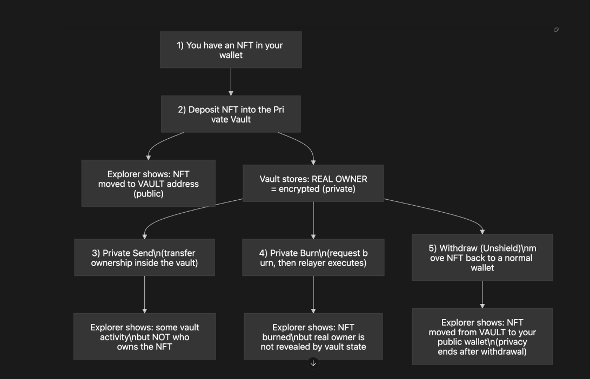
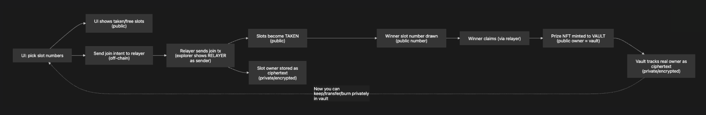

# Mogate RWA Raffle (EVM) + Privacy (coFHE)

This repo contains the EVM raffle contracts + scripts, plus privacy extensions built with **Fhenix coFHE**:

- **V1 (Transparent Raffle):** classic on-chain raffle (slot ownership is public).
- **V2 (Darkpool Raffle + Relayer):** slot ownership is stored **encrypted**, and a **relayer** is the visible sender on explorers.
- **Private Vault (ERC721):** NFTs sit in a public vault address, while the _real owner_ is tracked as an **encrypted address**.

More details: `docs/VAULT_FLOW.md`

## Relationship To The Older “v0” Repo

If your earlier EVM implementation lived in the `moga-mogate` repo on the `evm-network` branch, this repo is the focused continuation/extraction of that work, with the privacy roadmap added (Darkpool raffle + coFHE vault).

Reference (v0):

```text
https://github.com/dellwatson/moga-mogate/tree/evm-network
```

## User Flows (Simple)

### A) Private Vault (User View)



### B) Darkpool Raffle V2 + Relayer (User View)



## Key Contracts

- Transparent raffle (V1): `contracts/Raffle.sol`
- Darkpool raffle foundation (V2): `contracts/Raffle.darkpool.v2.sol`
- Darkpool raffle + vault claim: `contracts/Raffle.darkpool.v2.vault.sol`
- Vault (ERC721): `contracts/Vault.erc721.sol`

## Scripts (EVM)

- Compile: `bun run evm:compile`
- Deploy vault: `bun run evm:deploy:vault:erc721`
- Deploy raffle V2 (darkpool): `bun run evm:deploy:raffle:v2-darkpool`
- Deploy raffle V2 (darkpool + vault): `bun run evm:deploy:raffle:v2-darkpool-vault`

See `package.json` for the full list.

## Notes About Privacy

- On EVM, tx senders still exist. Privacy here means: observers can’t learn the _real owner / slot owner / positions_ from on-chain state or calldata because those values are ciphertext.
- The **relayer** improves sender privacy (explorer shows relayer), while coFHE protects the sensitive state.
